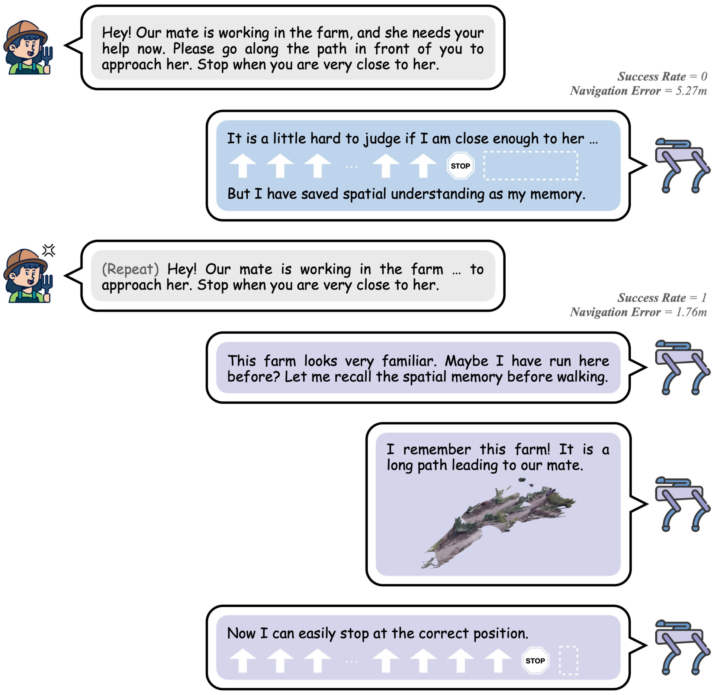
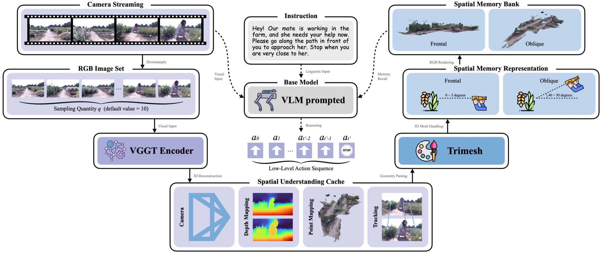

<div align="center">
<h1>SUM-AgriVLN: Spatial Understanding Memory for Agricultural Vision-and-Language Navigation</h1>

[Xiaobei Zhao](https://orcid.org/0009-0005-3123-5536) · Xingqi Lyu · [Xin Chen](https://faculty.cau.edu.cn/cx/)<sup>✉️</sup> · [Xiang Li](https://faculty.cau.edu.cn/lx_7543/)<sup>✉️</sup>

**[China Agricultural University](https://ciee.cau.edu.cn)**

xiaobeizhao2002@163.com, lxq99725@163.com, chxin@cau.edu.cn, cqlixiang@cau.edu.cn

<p>
  <a href="https://arxiv.org/abs/2510.14357"></a>
  <a href="LICENSE"></a>
</p>


</div>

## Updates
- [October 16th, 2025] The paper “SUM-AgriVLN: Spatial Understanding Memory for Agricultural Vision-and-Language Navigation” is available for reading on [arXiv](https://arxiv.org/abs/2510.14357).

## Overview
Agricultural robots are emerging as powerful assistants across a wide range of agricultural tasks, nevertheless, still heavily rely on manual operation or fixed rail systems for movement. The AgriVLN method and the A2A benchmark pioneeringly extend Vision-and-Language Navigation (VLN) to the agricultural domain, enabling robots to navigate to the target positions following the natural language instructions. In practical agricultural scenarios, navigation instructions often repeatedly occur, yet AgriVLN treat each instruction as an independent episode, overlooking the potential of past experiences to provide spatial context for subsequent ones. 

To bridge this gap, we propose the method of Spatial Understanding Memory for Agricultural Vision-and-Language Navigation (SUM-AgriVLN), in which the SUM module employs spatial understanding and save spatial memory through 3D reconstruction and representation. When evaluated on the A2A benchmark, our SUM-AgriVLN effectively improves Success Rate from 0.47 to 0.54 with slight sacrifice on Navigation Error from 2.91m to 2.93m, demonstrating the state-of-the-art performance in the agricultural domain.



## Quick Start
Currently, the paper “SUM-AgriVLN: Spatial Understanding Memory for Agricultural Vision-and-Language Navigation” is under review as a conference submission. After the paper is published, we will make the SUM-AgriVLN method available as soon as possible.

## Acknowledgment
This work is supported by the Sichuan Chengdu Modern Agricultural Industry Research Institute of China Agricultural University: Provincial and Municipal Agricultural Subsidy Funded Project; the Natural Science Foundation of Sichuan Province (2024NSFSC0389); and the Provincial and Municipal Agricultural Subsidy Special Funds for the Construction of CAU–SCCD Advanced Agricultural \& Industrial Institute. Thanks to Bangkok and Datong for the impressive traveling experiences, giving us a chilled vibe for experiment and writing. Thanks to Yuanquan Xu, the inspiration to us.

## Citation
If our paper or method is helpful for your research, welcome you use the following citation:
```bibtex
@inproceedings{SUM-AgriVLN,
  title={SUM-AgriVLN: Spatial Understanding Memory for Agricultural Vision-and-Language Navigation},
  author={Xiaobei Zhao and Xingqi Lyu and Xin Chen and Xiang Li},
  booktitle={arXiv:2510.14357},
  year={2025}
}
```

## Communication
If you have any issues with our study, welcome you contact the first author (Xiaobei Zhao, xiaobeizhao2002@163.com) to share your findings and thoughts with us.