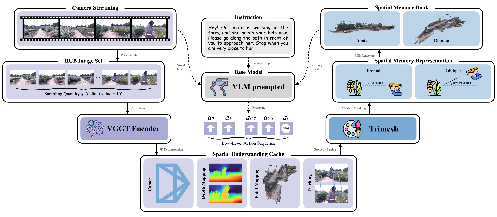

<div align="center">
<h1>SUM-AgriVLN: Spatial Understanding Memory for Agricultural Vision-and-Language Navigation</h1>
<a href="https://arxiv.org/abs/2509.06644"></a>

[Xiaobei Zhao](https://github.com/AlexTraveling), [Xingqi Lyu](https://github.com/AlexTraveling), [Xiang Li](https://faculty.cau.edu.cn/lx_7543/)

**[China Agricultural University](https://ciee.cau.edu.cn)**


</div>

## Overview
Agricultural robots are emerging as powerful assistants across a wide range of agricultural tasks, nevertheless, still heavily rely on manual operation or fixed rail systems for movement. The AgriVLN method and the A2A benchmark pioneeringly extend Vision-and-Language Navigation (VLN) to the agricultural domain, enabling robots to navigate to the target positions following the natural language instructions. In practical agricultural scenarios, navigation instructions often repeatedly occur, yet AgriVLN treat each instruction as an independent episode, overlooking the potential of past experiences to provide spatial context for subsequent ones. 

To bridge this gap, we propose the method of Spatial Understanding Memory for Agricultural Vision-and-Language Navigation (SUM-AgriVLN), in which the SUM module employs spatial understanding and save spatial memory through 3D reconstruction and representation. When evaluated on the A2A benchmark, our SUM-AgriVLN effectively improves Success Rate from 0.47 to 0.54 with slight sacrifice on Navigation Error from 2.91m to 2.93m, demonstrating the state-of-the-art performance in the agricultural domain. 



## Quick Start
The code of the SUM-AgriVLN method will be available after the paper is published.

## Cite
```bibtex
@inproceedings{SUM-AgriVLN,
  title={SUM-AgriVLN: Spatial Understanding Memory for Agricultural Vision-and-Language Navigation},
  author={Xiaobei Zhao and Xingqi Lyu and Xiang Li},
  booktitle={arXiv},
  year={2025}
}
```